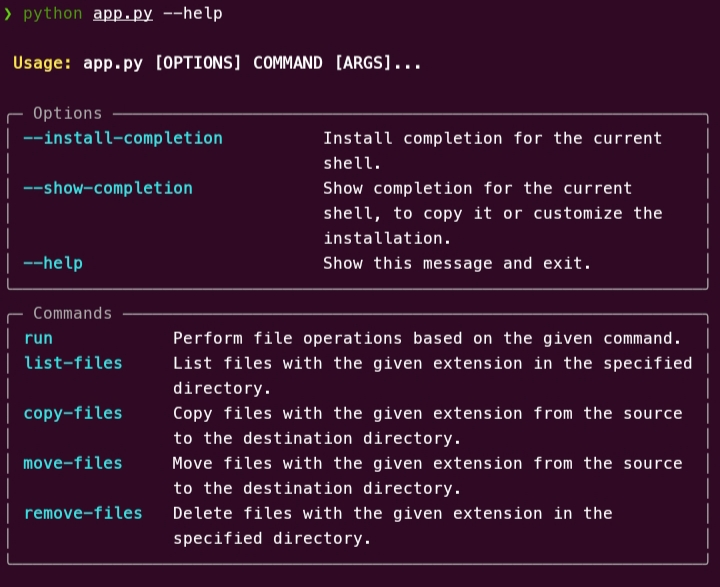

# File manipulation

This project generally handles files such as search, delete, copy, move with its extensions

### Table of contents

- [Manipulation des fichiers](#manipulation-des-fichiers)
  - [installation](#installation)
  - [use](#use)
  - [contribution](#contribution)
  - [licence](#licence)
  - [screenshoot](#screenshoot)

### installation

1. Clone le depot :

```bash
git clone https://github.com/styjii/FileManipulation.git
```

2. installez les dependance

```bash
python3 -m venv env
source env/bin/activate
python3 -m pip install -r requirement.txt
```

### use

To know how to use each command, use these commands :

```Bash
python3 app.py --help
python3 app.py run --help
python3 app.py sh --help
python3 app.py cp --help
python3 app.py mv --help
python3 app.py rm --help
```

### Contribution

1. Forkez le depot
2. cree une nouvelle branche :
3. Ajoitez vos modifications.
4. Poussez votre branche :
5. Cree une pull request.

### licence

This project is under MIT license

### screenshoot

HELP COMMAND REPRESENTATION


